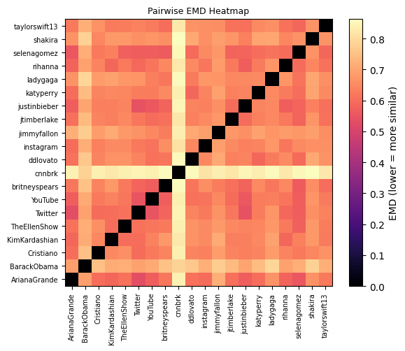
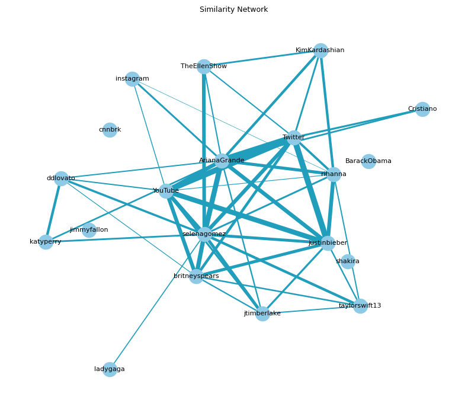
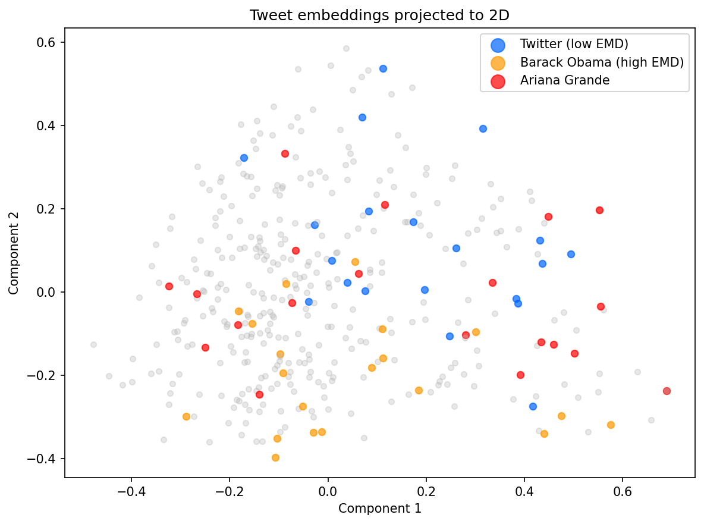

# Tweet EMD: Semantic Distance Analysis

Compute semantic distances between Twitter accounts using **Earth Mover's Distance (EMD)** to discover which accounts have similar content, messaging styles, and topics.



## What is Earth Mover's Distance?

**Earth Mover's Distance (EMD)**, also known as the Wasserstein distance, is a powerful metric for comparing probability distributions. Think of it like this:

Imagine you have two piles of dirt (representing two Twitter accounts' tweet distributions in semantic space). EMD measures the minimum amount of "work" needed to transform one pile into the other, where "work" is defined as the amount of dirt moved multiplied by the distance it travels.

In our context:
- Each **tweet** is represented as a point in high-dimensional semantic space (via sentence embeddings)
- Each **account** has a distribution of tweets (multiple points)
- **EMD** measures how different two accounts' tweet distributions are
- **Lower EMD** = more similar accounts (less "work" to transform one into the other)
- **Higher EMD** = more different accounts (more "work" required)

### Why EMD for Twitter Accounts?

Unlike simple metrics that compare single vectors, EMD can handle:
- **Variable tweet counts** per account
- **Multiple semantic clusters** within an account's tweets
- **Distribution-level similarity** rather than point-to-point matching

This makes it ideal for comparing accounts that may have diverse content but similar overall themes or messaging patterns.

## Overview

This project implements a semantic similarity analysis system that:

1. **Processes tweets** with intelligent preprocessing (URLs, hashtags, mentions, emojis)
2. **Generates embeddings** using state-of-the-art sentence transformers
3. **Computes EMD** between account tweet distributions using min-cost flow algorithms
4. **Visualizes results** with heatmaps, network graphs, and 2D projections

## Visualizations

<div align="center">

| EMD Heatmap | Similarity Network | Tweet Projection |
|:-----------:|:------------------:|:----------------:|
|  |  |  |
| Shows pairwise distances between all accounts. Darker colors = higher EMD (more different), lighter = lower EMD (more similar). | Network graph where accounts are connected by semantic similarity. Thicker edges = stronger similarity (lower EMD). | 2D PCA projection of tweet embeddings colored by account. Shows how tweets cluster in semantic space. |

</div>

In the projection above:
- **Red**: Ariana Grande (highlighted account)
- **Green**: Selena Gomez (similar account)
- **Orange**: Barack Obama (high EMD, different content)
- **Gray**: Other accounts

## Features

- **Sentence-level embeddings**: Uses `all-MiniLM-L6-v2` sentence transformer for superior semantic understanding compared to bag-of-words approaches
- **L2-normalization**: All tweet vectors are normalized for consistent cosine distance calculations
- **Cosine distance**: Ground cost metric `C_ij = 1 - x_i · y_j` for unit vectors
- **Intelligent preprocessing**: 
  - URL domain extraction
  - Hashtag splitting (camelCase detection)
  - Mention normalization (`@user`)
  - Emoji tokenization
- **Exact EMD computation**: Uses NetworkX min-cost flow with integer cost scaling for precise results
- **Top-k similar accounts**: Utility function to find the most similar accounts to any target

## Installation

```bash
pip install -r requirements.txt
```

Required packages:
- `sentence-transformers` - For generating tweet embeddings
- `networkx` - For EMD computation via min-cost flow
- `numpy` - Numerical operations
- `pandas` - Data handling
- `scikit-learn` - PCA and utilities
- `matplotlib` - Visualizations
- `pytest` - Testing

## Usage

### Basic Python Usage

```python
from tweet_emd import load_account_embeddings, top_k_similar_accounts

# Load embeddings from CSV
embeddings = load_account_embeddings("data/tweets_400.csv")

# Find top 5 similar accounts
target = "ArianaGrande"
similar = top_k_similar_accounts(target, embeddings, k=5)
for account, distance in similar:
    print(f"{account}: EMD = {distance:.4f}")
```

### Command Line Interface

```bash
# Run the main analysis
python tweet_emd.py --dataset data/tweets_400.csv

# Generate all visualizations
python visualizations.py

# Save visualizations to a directory
python visualizations.py --save-dir images
```

### Generating Visualizations

The visualization module provides three types of plots:

```python
from visualizations import (
    plot_emd_heatmap,
    plot_similarity_network,
    plot_tweet_projection,
    load_account_embeddings
)

embeddings = load_account_embeddings("data/tweets_400.csv")

# Generate and save visualizations
plot_emd_heatmap(embeddings, save_path="images/emd_heatmap.png")
plot_similarity_network(embeddings, max_edges=50, save_path="images/network.png")
plot_tweet_projection(embeddings, save_path="images/projection.png")
```

## Data Format

The input CSV file should have the following columns:
- `author`: Twitter account handle (e.g., "ArianaGrande")
- `content`: Tweet text content

Example:
```csv
author,content
ArianaGrande,"I love you so much"
Twitter,"What's happening?"
```

## How It Works

### 1. Preprocessing
Tweets are cleaned and normalized:
- URLs are extracted to their domains
- Hashtags are split on camelCase boundaries
- Mentions are normalized
- Emojis are tokenized

### 2. Embedding Generation
Each tweet is converted to a 384-dimensional vector using the `all-MiniLM-L6-v2` sentence transformer, which captures semantic meaning rather than just word frequency.

### 3. Normalization
All vectors are L2-normalized, making cosine distance equivalent to `1 - dot_product`.

### 4. EMD Computation
For two accounts A and B:
- Each account's tweets form a distribution in semantic space
- EMD finds the minimum cost flow to transform A's distribution into B's
- Cost is based on cosine distance between tweet embeddings
- The result is a single scalar distance value

### 5. Visualization
Results are visualized in multiple ways to provide different insights into account relationships.

## Project Structure

```
tweet-emd/
├── tweet_emd.py          # Main implementation with EMD computation
├── visualizations.py     # Visualization functions
├── test_tweet_emd.py     # Test suite
├── data/
│   └── tweets_400.csv    # Sample dataset
├── images/               # Generated visualization images
│   ├── emd_heatmap.png
│   ├── similarity_network.png
│   └── tweet_projection.png
└── requirements.txt      # Python dependencies
```

## Example Results

When analyzing Twitter accounts, you might find:
- **Celebrity accounts** with similar fan engagement styles cluster together
- **News accounts** form distinct clusters based on political leaning or topic focus
- **Entertainment accounts** show different patterns from political accounts (high EMD)
- **Personal accounts** of similar individuals have lower EMD than accounts with different purposes

## Technical Details

### EMD Algorithm
The implementation uses NetworkX's min-cost flow solver with integer cost scaling for efficiency. The algorithm:
1. Converts cosine distances to integer costs
2. Constructs a flow network
3. Solves for minimum cost flow
4. Returns the normalized EMD value

### Embedding Model
The `all-MiniLM-L6-v2` model is a lightweight but powerful sentence transformer that:
- Produces 384-dimensional vectors
- Captures semantic relationships
- Runs efficiently on CPU
- Works well for short texts like tweets

## Testing

Run the test suite:

```bash
pytest test_tweet_emd.py
```

Tests verify:
- Embedding normalization
- EMD symmetry (EMD(A,B) = EMD(B,A))
- Self-distance is approximately zero
- Top-k results are properly sorted

## History

This project evolved from a TF-IDF based implementation to the current sentence embedding approach. The git history preserves this evolution, showing the transition from bag-of-words to semantic embeddings.

## License

[Add your license here]
